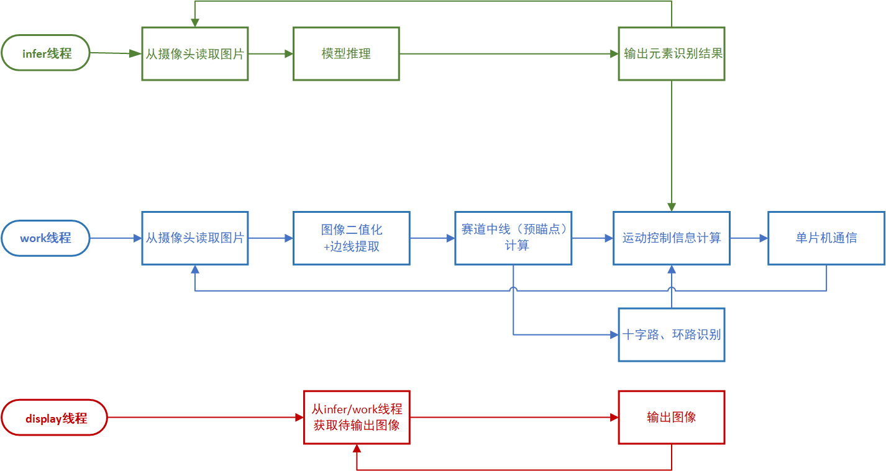

# Car2024：完全模型组智能车巡线程序

**编程语言：** C++

**开发平台：** Visual Studio

**依赖库：** OpenCV

## 一、项目概述

本程序部署在 edgeboard 上，负责视觉巡线，并根据巡线结果控制小车运动，将控制信息发送给单片机。在巡线过程中，程序完成以下任务：

1. **提取赛道边线，根据边线计算小车运动的预瞄点，然后使用相关的运动控制算法计算出小车运动信息并发送给单片机。**

2. **识别赛道中的基础特殊元素，包括十字路、环路，并作出相应的响应来控制小车运动。**

3. **对于一些特殊元素，如赛道上或赛道旁的 3D 打印标志，使用目标检测任务的 AI 模型进行元素识别，并根据识别结果控制小车运动。**

4. **在调试模式下，程序还可以实时输出摄像头读取的源图像、带有巡线结果标记的图像等信息，用于检测小车巡线情况。**

## 二、程序结构

### 1. 功能模块结构

本程序由多个功能模块类和一个集成这些模块的 Car 类组成。Car 类的功能是控制这些模块之间的交互和各自的运作，实现程序的主体逻辑；各个功能模块类则分别用于小车不同功能的实现。各个功能模块类的用途如下：

|         类名         |                   功能                    |
| :------------------: | :---------------------------------------: |
|      **Config**      |   读取 json 配置文件，加载程序相关参数    |
|   **Communicator**   |            程序与单片机的通信             |
| **CrossingDetector** |                十字路识别                 |
|   **RingDetector**   |                 环路识别                  |
|    **AIDetector**    |       利用 AI 模型进行特殊元素识别        |
| **MotionController** | 车道线提取、中线/预瞄点计算、车辆运动控制 |

各个功能模块以成员变量的方式组合在 Car 类中。

### 2. 线程结构

本程序在运行后会启动 3 个子线程，并行地处理不同的任务。3 个子线程的名称及功能如下：

|    名称     |                                                     功能                                                     |
| :---------: | :----------------------------------------------------------------------------------------------------------: |
|  **work**   |  执行巡线主体逻辑（除了模型推理的部分）：以循环方式不断地从摄像头读取图片，然后进行巡线计算和控制信息的发送  |
|  **infer**  | 执行模型推理：以循环方式不断地从摄像头读取图片，然后使用 AI 模型进行推理，最后将元素识别结果发送给 work 线程 |
| **display** |           调试图像输出：通过线程间队列获取来自 work 和 infer 线程待输出的处理后图像并显示在屏幕上            |

线程功能逻辑图

以上线程均以类成员函数的方式实现在 Car 类中。线程间的数据通信计划使用队列实现，例如 work/infer 线程将处理后图像放入队列，display 从队列读取出图像并显示在屏幕上。线程间队列的读写要注意锁的使用以避免访问冲突问题。

## 三、文件结构说明

- config：该目录下有一个 config.json，存储有程序的 json 配置信息
- include：各个功能模块类的实现（头文件），一个类对应一个头文件
- libs：项目使用的第三方库，目前只有一个读取 json 文件的库
- res：资源文件存储目录（视频、图片等）
- src：项目 cpp 文件存储，目前只有 main.cpp
- mannuals：项目具体的说明文档，可以存放各个部件实现思路说明。
- CMakeLists.txt：cmake 配置信息，要在自己电脑上运行这个程序（目前只验证了这个项目在 Visual Studio 上的运行情况）的话需要修改这里面 OpenCV_DIR 的路径，修改为本机 OpenCV 的 build 目录。

## 四、部署说明

1. **环境配置：** 确保你的开发环境中已经安装了 C++ 编译器和 Visual Studio。此外，你还需要安装 [OpenCV](https://opencv.org/releases) 库。

2. **下载源代码：** 从 GitHub 上克隆或下载本项目的源代码。

3. **配置 OpenCV：** 配置 OpenCV 库的路径。在 `CMakeLists.txt` 文件中，修改 `OpenCV_DIR` 的路径，将其设置为你本机上 OpenCV 的 `build` 目录。

4. **编译：** 使用 CMake 工具编译本项目，配置选择 x64 Release。
