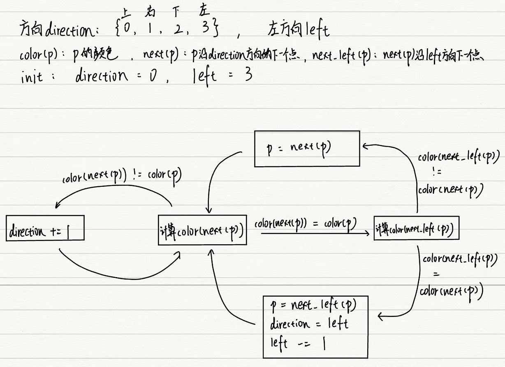

# 巡线思路

src: [第16届智能车智能视觉组-上海交通大学AuTop战队开源汇总 - 知乎 (zhihu.com)](https://zhuanlan.zhihu.com/p/391252945)

##### 车道线检测+中线提取

* 输入：灰度图像
* 迷宫法巡线 + 自适应二值化阈值（不对全图二值化，遇到的点才进行二值化）
* 迷宫法示意图（左车道线为例）：

* 分别对左车道线和右车道线使用迷宫法进行检测，可得到两条车道线的采样数据
* （未实现）然后，使用透视变换，将两条车道线的点信息转换为俯视图下信息
* 参考去年代码中/官方代码中的识别方式？

##### 直道/弯道巡线

* 可利用提取出来的左边线和右边线其中一个来进行巡线
* 将边线向赛道中心平移特定的一段距离作为中线
* 选取中线上的点作为预瞄点，计算车辆运动的方向
* 参考去年代码中/官方代码中的识别方式？

##### 十字路巡线

* 利用“角点”识别十字路
* 一种识别“角点”的方法：对俯视视角下的边线数据计算角度（利用向量点乘等方式），角度满足一定条件后认为遇到了角点
* 参考去年代码中/官方代码中的识别方式？

##### 环岛巡线

* 利用“”角点“识别环岛以及环岛方向（左/右）

* 以右环岛为例，环岛巡线可分为以下几个阶段：

1. 左边线检测成功，右边线丢线——进入环岛区域，切换至右边线巡线（使用右边线数据进行巡线）
2. 左右边线都检测成功——成功进入环岛区域，保持巡线策略不变
3. 左边线丢线，右边线检测成功——开始驶出环岛，保持巡线策略不变直至左边线检测成功
4. 左右边线都检测成功——切换左边线巡线以驶出环岛，进入直道巡线模式

* 参考去年代码中/官方代码中的识别方式？

